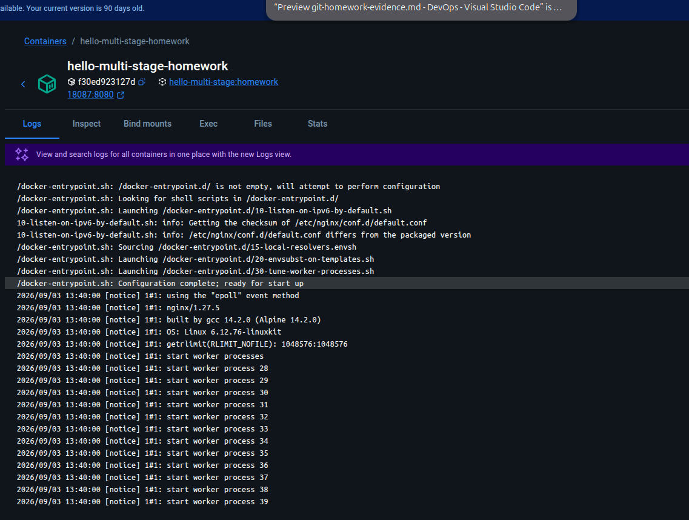

# Docker Hello World Homework

This directory contains Docker image and container exercises covering basic images, multiple application runtimes, React, and a multi-stage build.

## Projects

| Directory | Purpose |
| --- | --- |
| `docker-demo` | Basic Dockerfile demonstration |
| `hello-node` | Node.js HTTP application |
| `hello-python` | Python HTTP application |
| `hello-java` | Java HTTP application |
| `hello-apache` | Apache static web server |
| `hello-nginx` | Nginx static web server |
| `hello-react` | React application served from a container |
| `multi-stage-hello` | Multi-stage Node.js build with Nginx serving the generated page |

The Docker networking exercises are documented separately in [`Networking/README.md`](../Networking/README.md), including bridge networks, host networking, bind mounts, and overlay networks.

Six separate Dockerized Hello World applications are included:

| Application | Folder | Host URL | Container port |
| --- | --- | --- | --- |
| Node.js | `hello-node` | http://localhost:18081 | 8080 |
| Python | `hello-python` | http://localhost:18082 | 8080 |
| Java | `hello-java` | http://localhost:18083 | 8080 |
| Apache | `hello-apache` | http://localhost:18084 | 80 |
| Nginx | `hello-nginx` | http://localhost:18085 | 80 |
| React | `hello-react` | http://localhost:18086 | 80 |

## Build

Run these commands from the repository root:

```sh
docker build -t hello-node:homework Docker/hello-node
docker build -t hello-python:homework Docker/hello-python
docker build -t hello-java:homework Docker/hello-java
docker build -t hello-apache:homework Docker/hello-apache
docker build -t hello-nginx:homework Docker/hello-nginx
docker build -t hello-react:homework Docker/hello-react
```

## Run

```sh
docker run -d --name hello-node-homework -p 18081:8080 hello-node:homework
docker run -d --name hello-python-homework -p 18082:8080 hello-python:homework
docker run -d --name hello-java-homework -p 18083:8080 hello-java:homework
docker run -d --name hello-apache-homework -p 18084:80 hello-apache:homework
docker run -d --name hello-nginx-homework -p 18085:80 hello-nginx:homework
docker run -d --name hello-react-homework -p 18086:80 hello-react:homework
```

## Verification

The Node.js, Python, Java, Apache, and Nginx endpoints returned their expected Hello World text with `curl`. The React endpoint displayed `Hello World from React` as a rendered heading in the browser at http://localhost:18086.

To stop the containers:

```sh
docker rm -f hello-node-homework hello-python-homework hello-java-homework hello-apache-homework hello-nginx-homework hello-react-homework
```

## Multi-stage Build Evidence

The multi-stage example generates a web page during the build stage and serves it from Nginx in the final image.


