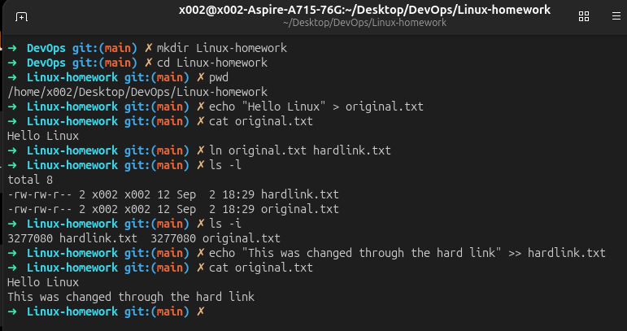
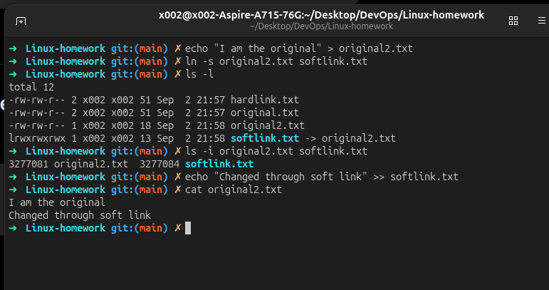
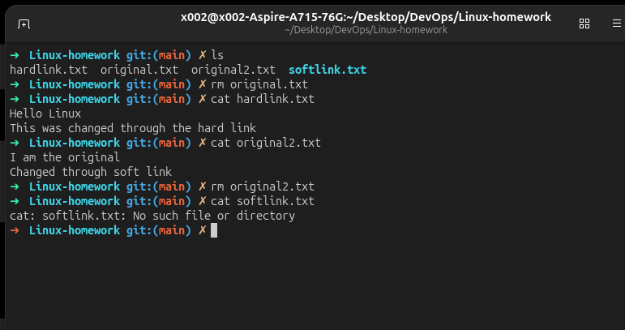
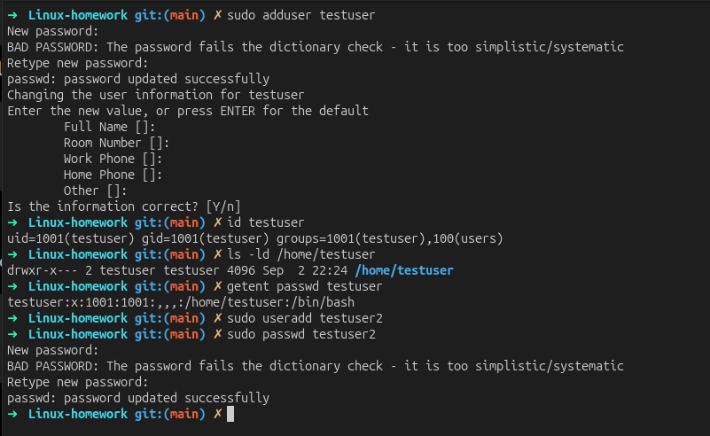
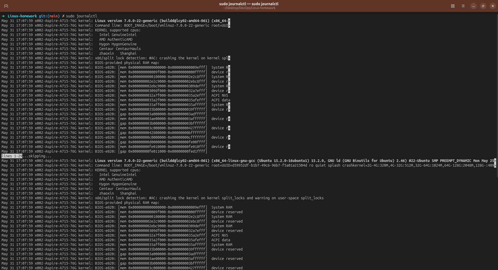
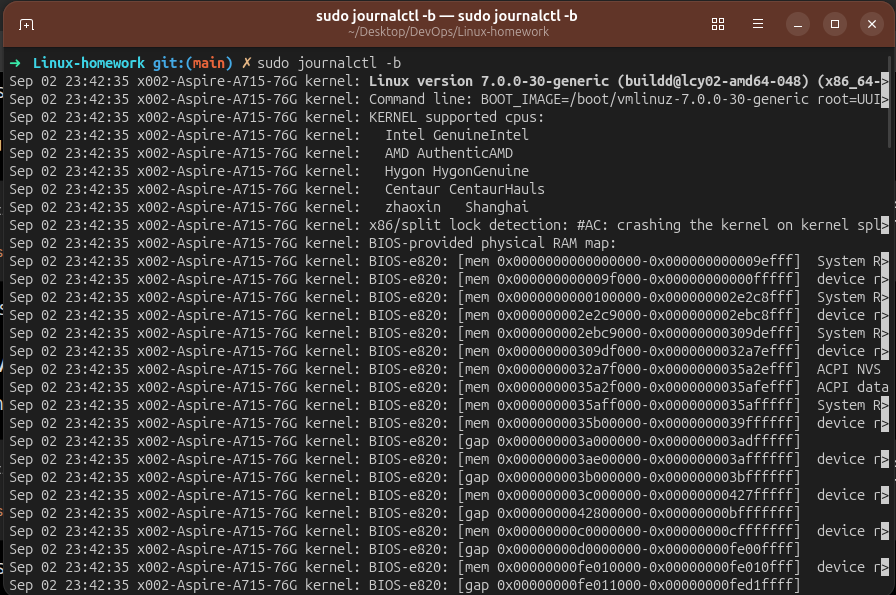
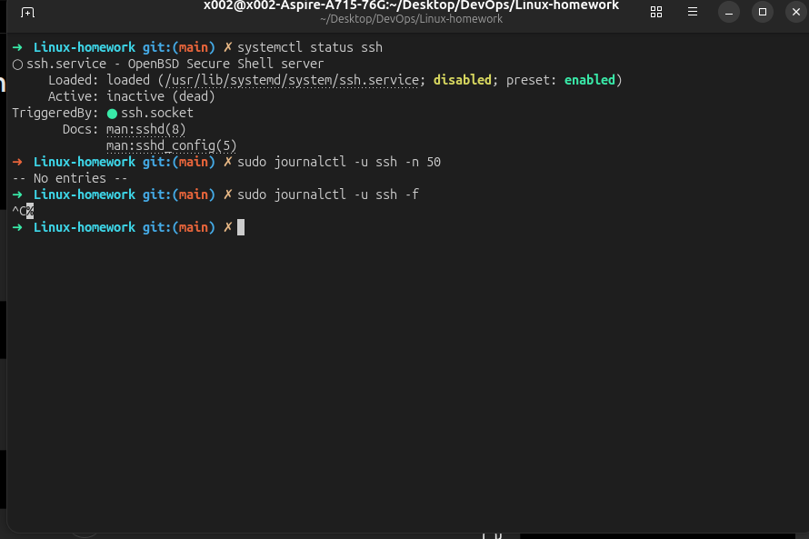

# Linux Homework

This repository contains practice work for common Linux administration and command-line topics.

## Task 1: Soft Links and Hard Links

### Hard links

A hard link is another directory entry for the same inode as the original file. Both names refer to the same file data, so changing the content through one name is visible through the other. A hard link normally continues to work if the original filename is deleted.

Create a hard link:

```bash
ln original.txt hardlink.txt
```

Check inode numbers and link details:

```bash
ls -li original.txt hardlink.txt
```

Remove a hard link:

```bash
rm hardlink.txt
```

### Soft links

A soft link, or symbolic link, stores a path to another file. It has its own inode and becomes dangling when its target is deleted or moved.

Create a soft link:

```bash
ln -s original2.txt softlink.txt
```

Check the link target:

```bash
ls -l softlink.txt
```

Remove a soft link:

```bash
rm softlink.txt
```

### Evidence

The screenshots below show the link and removal exercises:







### Interview summary

| Feature | Hard link | Soft link |
| --- | --- | --- |
| Created with | `ln source link` | `ln -s source link` |
| Inode | Same as the source | Different from the source |
| Cross-filesystem support | No | Yes |
| Can link to a directory | Usually no | Yes |
| Works after source filename is deleted | Yes, while a hard link remains | No, the link becomes dangling |

## Task 2: `adduser` vs `useradd`

### Difference

- `useradd` is a lower-level command that creates a user and usually requires additional options for the home directory, shell, password, and other settings.
- `adduser` is a friendlier interactive Perl-based frontend available on Debian and Ubuntu. It applies sensible defaults and guides the administrator through account creation.

On Ubuntu, `adduser` is generally preferred for manually creating a normal user because it is interactive and less error-prone:

```bash
sudo adduser testuser
```

> [!NOTE]
> Do not run account-creation commands on a production system without confirming the intended username and permissions.

### Practice evidence



### Notes

The recommended Ubuntu command was used to create `testuser`:

```bash
sudo adduser testuser
id testuser
ls -ld /home/testuser
getent passwd testuser
```

The screenshot shows that `testuser` was created with UID/GID `1001`, received a home directory at `/home/testuser`, and uses `/bin/bash`. A second account, `testuser2`, was created with the lower-level `useradd` command and then given a password manually.

## Task 3: `journalctl`

`journalctl` is used to query logs collected by the systemd journal. It can display system-wide events, boot logs, kernel messages, and logs for individual services.

Useful commands:

```bash
# View all available journal entries
journalctl

# View entries from the current boot
journalctl -b

# Follow new log entries in real time
journalctl -f

# View logs for a specific service
sudo journalctl -u ssh

# View recent logs for a service
sudo journalctl -u ssh --since "1 hour ago"
```

### Practice evidence







### Notes

The journal was viewed with `sudo journalctl` and filtered to the current boot with
`sudo journalctl -b`. The SSH service was checked with `systemctl status ssh` and
`sudo journalctl -u ssh -n 50`; the screenshot shows that SSH was inactive and had
no journal entries at the time of the check. The follow mode was also started with
`sudo journalctl -u ssh -f` and stopped with `Ctrl+C`.

## Task 4: Linux Command Cheat Sheet

### Commands to review

| Command | Purpose | Example |
| --- | --- | --- |
| `pwd` | Print the current directory | `pwd` |
| `ls` | List directory contents | `ls -la` |
| `cd` | Change directory | `cd /var/log` |
| `mkdir` | Create a directory | `mkdir practice` |
| `touch` | Create an empty file or update its timestamp | `touch notes.txt` |
| `cp` | Copy files or directories | `cp source.txt backup.txt` |
| `mv` | Move or rename files | `mv old.txt new.txt` |
| `rm` | Remove files | `rm notes.txt` |
| `cat` | Display file contents | `cat notes.txt` |
| `less` | Read a file page by page | `less /var/log/syslog` |
| `grep` | Search text | `grep "error" app.log` |
| `find` | Search for files | `find . -name "*.txt"` |
| `chmod` | Change permissions | `chmod 644 notes.txt` |
| `chown` | Change owner and group | `sudo chown user:group notes.txt` |
| `ps` | Display running processes | `ps aux` |
| `top` | Monitor running processes | `top` |
| `df` | Show filesystem space | `df -h` |
| `du` | Show file or directory usage | `du -sh .` |
| `man` | Open a command manual | `man chmod` |

### Practice evidence

The commands in the table were reviewed and practiced during the Linux exercises.
The link, user-management, and log-management screenshots above provide evidence
of using several of these commands in the terminal.

### Notes

The most frequently used commands were `pwd`, `ls`, `cd`, `mkdir`, `touch`, `cp`,
`mv`, `rm`, `cat`, `grep`, `find`, `chmod`, `chown`, `ps`, `top`, `df`, `du`, and
`man`.

## Status

- [x] Task 1: Soft links and hard links
- [x] Task 2: `adduser` and `useradd`
- [x] Task 3: `journalctl`
- [x] Task 4: Linux command cheat sheet
