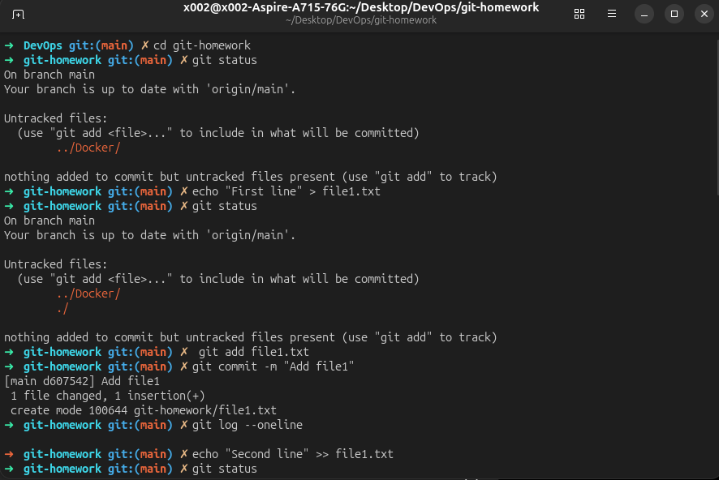
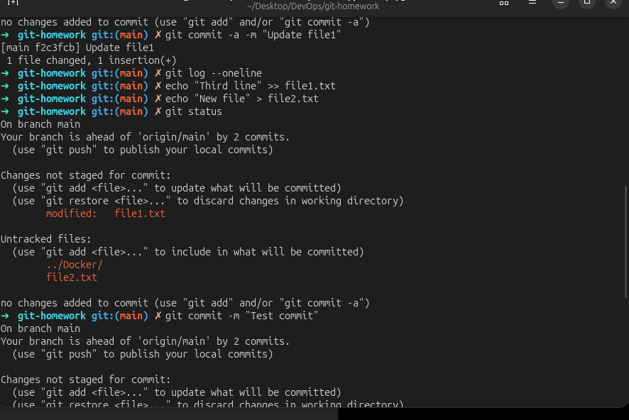
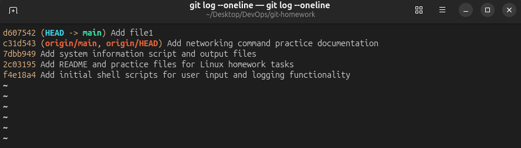

# Git and GitHub Homework

This directory contains exercises demonstrating Git commits, branches, cherry-picks, logs, and common repository workflows.

## Contents

| File or directory | Description |
| --- | --- |
| [`git-homework-evidence.md`](git-homework-evidence.md) | Detailed command output and explanations |
| `main1.txt`, `main2.txt`, `main3.txt` | Files created on the main branch |
| `feature3.txt` | Feature branch exercise file |
| `commit-m-demo.txt` | Demonstration of staging a new file before committing |
| `cherry-pick-result.txt` | Result of cherry-picking a commit into `main` |
| `img/` | Screenshots from Git exercises |

## Git Workflow

```sh
git status
git add <file>
git commit -m "Describe the change"
git log --oneline --decorate
git switch -c feature-name
git switch main
git cherry-pick <commit>
```

`git commit -a -m` includes modifications and deletions to tracked files, but not new untracked files. New files must be staged with `git add` first.

## GitHub Workflow

The same local workflow can be shared with GitHub by connecting a remote repository:

```sh
git remote add origin <github-repository-url>
git push -u origin main
git pull --rebase origin main
```

For collaborative work, create a feature branch, push it to GitHub, open a pull request, review the changes, and merge it into `main` after checks pass.

## Git Screenshots





